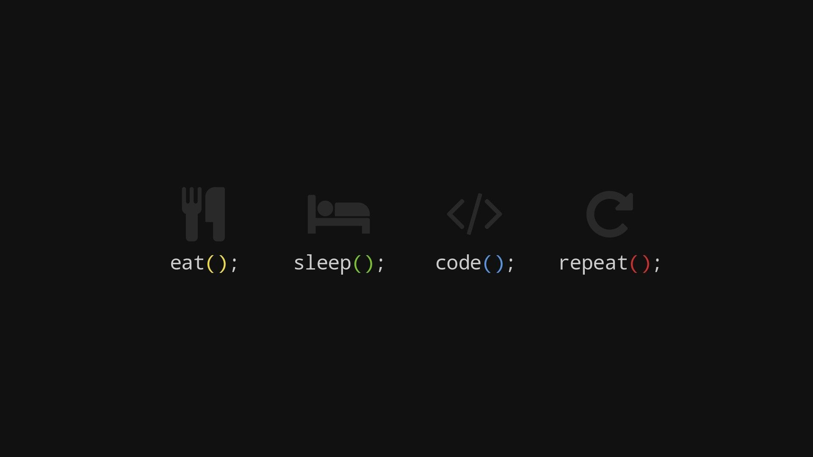
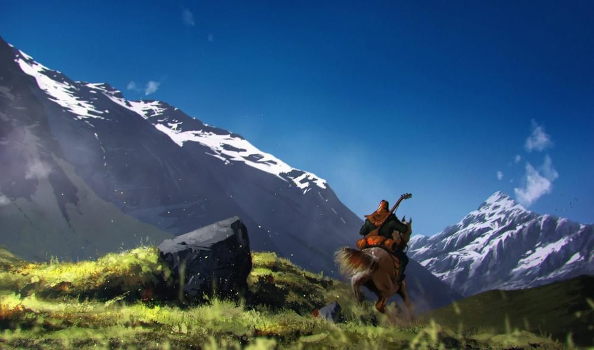

 

  

 

  

 

  

 

  

 

  

 

  

 

  

 

  

 

  

 

  

 

  

 

  

 

  

 

  

 

  

 

  

 

  

 

  

 

  

 

  

 

  

 

  

 

  

 

  

 

  

 

  

 

  

 

  

 

  

 

  

 

  

 

  

 

  

 

  

 

  

 

  

 

  

 

  

 

  

 

  

 

  

 

  

 

  

 

  

 

  

 

  

 

  

 

  

 

  

 

  

 

  

 

  

 

  

 

  

 

  

 

  

 

  

 

  

 

  

 

  

 

  

 

  

 

  

 

  

 

  

 

  

 

  

 

  

 

  

 

  

 

  

 

  

 

  

 

  

 

  

 

  

 

  

 

  

 

  

 

  

 

  

 

  

 

  

 

  

 

  

 

  

 

  

 

  

 

  

 

  

 

  

 

  

 

  

 

  

 

  

 

  

 

  

 

  

 

  

 

  

 

  

 

  

 

  

 

  

 

  

 

  

 

  

 

  

 

  

 

  

 

  

 

  

 

  

 

  

 

  

 

  

 

  

 

  

 

  

 

  

 

  

 

  

 

  

 

  

 

  

 

  

 

  

 

  

 

  

 

  

 

  

 

  

 

  

 

  

 

  

 

  

 

  

 

  

 

  

 

  

 

  

 

  

 

  

 

  

 

  

 

  

 

  

 

  

 

  

 

  

 

  

 

  

 

  

 

  

 

  

 

  

 

  

 

  

 

  

 

  

 

  

 

  

 

  

 

  

 

  

 

  

 

  

 

  

 

  

 

  

 

  

 

  

 

  

 

  

 

  

 

  

 

  

 

  

 

  

 

  

 

  

 

  

 

  

 

  

 

  

 

  

 

  

 

  

 

  

 

  

 

  

 

  

 

  

 

  

 

  

 

  

 

  

 

  

 

  

 

  

 

  

 

  

 

  

 

  

 

  

 

  

 

  

 

  

 

  

 

  

 

  

 

  

 

  

 

  

 

  

 

  

 

  

 

  

 

  

 

  

 

  

 

  

 

  

 

